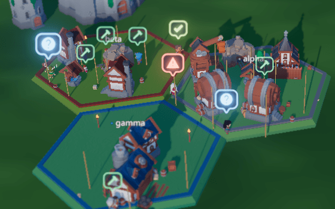
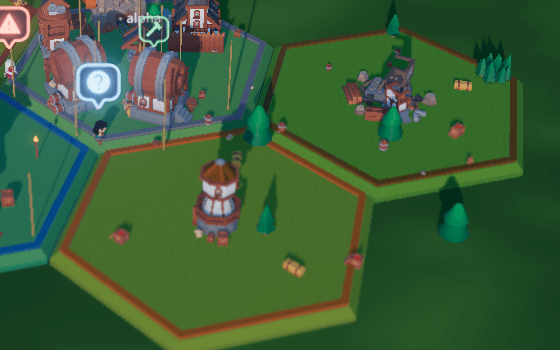
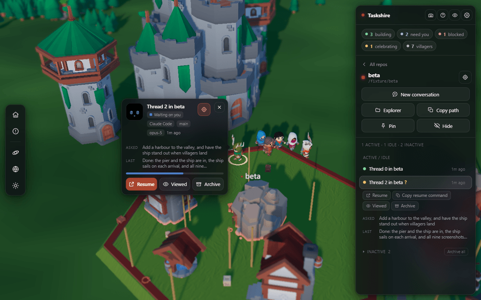
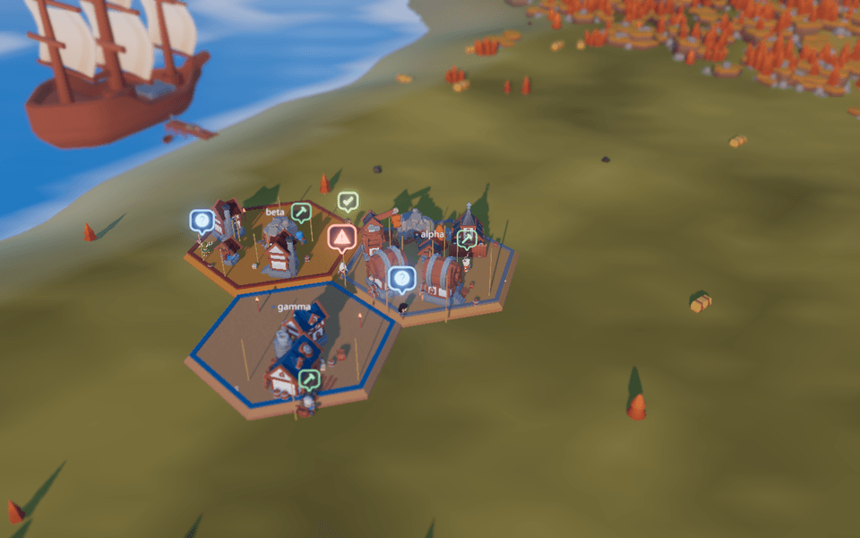
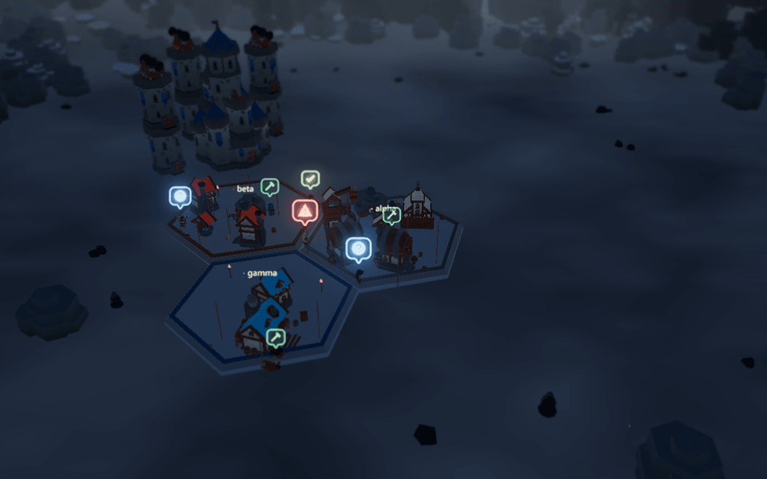

# Taskshire — your agent threads, as a medieval village

*A medieval fork of [Bot Crossing](https://github.com/Station-Sciences/bot-crossing).*

Taskshire is a medieval village where every coding-agent thread on your machine becomes a
villager. Each repo is a zone, a plot of land with a building for every thread, and the building
grows as the work of the thread grows. When a thread needs you, its villager stops and holds a
`?` over its head. Click the villager to open its card, which shows your first request and the
last reply of the agent. Press Resume, and you are back in the VS Code window, terminal or
desktop app where that repo is open.

Taskshire is built on **[Bot Crossing](https://github.com/Station-Sciences/bot-crossing)** by
[Jarren Rocks](https://jarren.rocks) (see [botcrossing.com](https://botcrossing.com) and
[TRADEMARKS.md](TRADEMARKS.md)). His space colony is still here, one click away under
Settings › Theme. All credit to Jarren for the original concept. The fork's own additions are in
the list below.

Taskshire reads the files of each harness on your own machine. It uploads nothing and needs no
account. **Taskshire never writes to a harness.** The only file that Taskshire writes is
`data/colony.json`, which stores the map.

> **Status:** The fork is kept on a best-effort basis. Issues and pull requests are welcome, and
> the maintainer reads them when time allows. [CONTRIBUTING.md](CONTRIBUTING.md) tells you what
> to expect.


## What this fork adds

### The village

1. **A medieval village and its cast.** A fresh install opens on KayKit's hexagon village, with
   keeps, towers, windmills, a water wheel, cannons and ships. Eight adventurers live in it, each
   with its own trade and a shield in the colour of its repo. The original space colony is still
   available under Settings.
2. **Subagents as half-size helpers.** When a thread starts subagents, small helpers in the repo
   colour appear beside its villager. The helpers leave when their work is done.
3. **Three settings and four seasons.** A forest with a keep, a valley with a coastline and a
   ship, and a mountain with a fortress. The Season switch puts any season on any setting.
4. **Buildings grow with the work.** A building starts as scaffolding, then gets walls, a yard,
   torches and a pennant. After dark, the torches light the village.
5. **Rest, sleep and ghost towns.** A villager sits down after 1 quiet day and lies down after 3.
   A repo that is quiet for 3 days becomes a ghost town: crates stand open, saplings grow, and the
   houses fall into ruin. When you reopen a thread, its villager walks back out of the keep (all adjustable in settings).

<p>
  
  
</p>

### Knowing what each agent is doing, and getting back to it

6. **The card says what the thread is about.** Click a villager, or its row in the sidebar, to
   see the first thing that you asked and the last thing that the agent said. You can find the
   one thread you want among 20 without opening any of them.
7. **Resume takes you back to where you work.** A setting selects the target. The first target is
   the VS Code workspace that already has the repo open: Taskshire finds it among your multi-root
   workspaces and brings it forward, or opens a new window. The other targets are the desktop app
   of the harness, or the resume command with its ID, copied and ready to paste into your
   terminal. Taskshire never resumes a thread that still runs.
8. **Four thread states, read from Claude Code's own session list.** Active, idle (open and
   waiting for you), inactive (closed) and archived. **Viewed** clears the `?` of an idle thread.
9. **Windows and MacOS Compatible.** Session records, links, folders and drive-letter spellings
   all work on Windows. On macOS and Linux, the openers go through the operating system as before.
10. **Only real sessions.** Sessions that plugins start through an SDK, and one-line stub files,
    no longer count as threads.
11. **Quiet repos fade, then leave.** After 3 quiet days a zone fades. After 14 days (adjustable in settings) the repo
    leaves the map for a Gone list, and it comes back to the same ground when a thread wakes it.
    Both times are adjustable in Settings, and Pin and Hide override them for each repo.
12. **A repo list you can filter.** Active, Idle, Inactive and Archived chips, a name filter, a
    Hide button on every row, and one Archive section with an Unarchive button beside each thread.
13. **Compact, and zones that move themselves.** One button repacks the map. A zone that its
    neighbours box in moves to open ground and takes its villagers with it.



### Fixes to the original space theme

14. **The bots reach their work.** A bot no longer walks into a wall forever, building footprints
    no longer cut off work sites, and the walking area covers every tile that a zone can get.
15. **The details that never showed.** The welding sparks now fire on the downbeat of the hammer.
    A retiring building no longer freezes as a stump, a full zone no longer stacks houses inside
    each other, and scenery no longer overhangs the zones.

<p>
  
  
</p>

## Run it

1. Install Node 22.13 or newer.
2. Clone the repo and start the dev server:

   ```bash
   git clone https://github.com/MoreCowwbell/taskshire.git
   cd taskshire
   npm install && npm run dev
   ```

3. Open the address that the dev server prints (`http://localhost:5274` by default).

Taskshire reads the same session files that the harnesses write. On a machine with Claude Code or
Codex threads, the village fills with your own work immediately.

| Command | What it does |
| --- | --- |
| `npm run dev` | Runs everything: the API lives inside the Vite dev server |
| `npm start` | Builds the app, then serves the build |
| `npm run serve` | Serves an existing `dist/` |
| `npm test` | Runs the unit suite |
| `npm run test:visual` | Compares 9 reference screenshots, byte for byte |
| `npm run test:smoke` | Boots the real page on each theme and clicks through the whole HUD |

The two slower gates, `test:visual` and `test:smoke`, need `npx playwright install chromium`
first. About the screenshot references:

- They were recorded on Windows, in the Chromium that Playwright 1.63 installs, rendered on the
  CPU through SwiftShader.
- On another OS or Playwright version, record your own references first with
  `npm run test:visual:update`, then compare your change against those.
- The 4 space screenshots are frozen: `--update` refuses to rewrite them unless you set
  `ALLOW_SPACE_BASELINE=1`.

The server binds to `127.0.0.1` and answers only its own page; see
[Keeping it local](#keeping-it-local). Taskshire opens threads and folders through the operating
system: `open(1)` on macOS, `xdg-open` on Linux, ShellExecute on Windows. On Linux, if no desktop
app answers the link, a terminal opens with the CLI of the harness instead.

## Which harnesses work

A **harness** is the program that runs your threads. Taskshire reads the local session files of
each harness through a small adapter.

| Harness | Status |
| --- | --- |
| **[Claude Code](https://claude.com/claude-code)** (Anthropic) | ✅ **Supported** — desktop app and CLI, including worktrees and live-process detection |
| **[Codex](https://developers.openai.com/codex/cli)** (OpenAI) | ✅ **Supported** — desktop, VS Code and CLI sessions, opened through `codex://` |
| **[OpenCode](https://opencode.ai)** | ✅ **Supported** — top-level sessions from its own store; no per-thread link to open |
| **[Antigravity CLI](https://antigravity.google)** (Google) | ✅ **Supported** — transcripts, opened through `antigravity://`. The successor to Gemini CLI, which Google stopped serving individual accounts on 18 June 2026 |
| **[Cursor](https://cursor.com)** (Anysphere) | ✅ **Supported** — agent transcripts; the composer and sidebar threads are not read yet |
| **[Hermes](https://github.com/NousResearch/hermes-agent)** (Nous Research) | ✅ **Supported** — sessions per pilot profile. Hermes lives in the terminal and chat apps, so there is no link to open |
| **[Kilo Code](https://kilocode.ai)** | ✅ **Supported** — top-level sessions; a thread opens as its repo folder in VS Code |
| [Amp](https://ampcode.com) (Sourcegraph) | ⬜ Not yet |
| [Aider](https://aider.chat) | ⬜ Not yet |
| [Goose](https://block.github.io/goose/) (Block) | ⬜ Not yet |
| [Qwen Code](https://github.com/QwenLM/qwen-code) (Alibaba) | ⬜ Not yet |
| [Amazon Q Developer CLI](https://aws.amazon.com/q/developer/) | ⬜ Not yet |

Every installed harness shows up at once, and each villager carries the name of its harness.

### Adding one

A new harness is one new file in `server/harnesses/` and one line in its `index.mjs`. The
interface, the thread shape and how to find a harness's session files are in
**[`server/harnesses/README.md`](server/harnesses/README.md)**.

A PR is welcome; read [CONTRIBUTING.md](CONTRIBUTING.md) first. An adapter that also works on the
original Bot Crossing belongs upstream too, so that every fork gets it. If the adapter needs
changes to the scanner or to `src/`, say so in the PR: the interface then needs widening.

## What you are looking at

| In the village | In your threads |
| --- | --- |
| One hex zone | One repo. A bigger repo gets more tiles: 1 tile per 7 threads |
| One villager (a bot in space) and one building | One thread |
| How finished a building looks | How large its transcript is, on a log scale |
| Scaffolding | Somebody works at that site now |
| A villager walks in from the keep or the ship | A thread that just appeared |
| A villager walks back into the keep or the ship | You archived the thread |
| A half-size helper | A subagent that the thread runs now |

Each thread does one thing at a time. The first row that matches wins, and only the states that
need something from you get a badge:

| Signal | What the villager does | Badge |
| --- | --- | --- |
| Errored | Slumps | `!` |
| Running now | Works at its building | `⚒` |
| PR merged | Jumps and cheers | `✓` |
| Unread, or idle and not yet marked viewed | **Stops and waits for you** | `?` |
| Nothing for 1 day | Sits down, awake | — |
| Nothing for 3 days | Sits down and sleeps | — |
| Anything else | Wanders around its zone | — |

### How the map behaves

- **Zones stay where they are.** The layout is sticky, so you can learn the map. A repo keeps its
  tiles as it grows and shrinks, and only a new repo takes new ground. `data/colony.json` keeps
  the layout across reloads.
- **You can move a zone.** Press and hold a zone, drag it, and drop it on free ground. The
  footprint shows green where it can land and red where it cannot.
- **Quiet repos fade, then leave.** *Fade after* (3 days) and *Hide after* (14 days) in the Repos
  group set the times. Anything running, unread or errored wakes a zone at once.
- **Hidden and Gone.** **Pin** keeps a repo on the map; **Hide** takes it off. The *Hidden* and
  *Gone* lists at the foot of the sidebar bring a repo back in one click, and **Clear all**
  empties a list in two.
- **Helpers are not threads.** A helper claims no tiles and cannot be archived. It leaves when its
  subagent finishes, or after 20 quiet minutes.

## Using it

Everything is in one panel on the right. Click a villager, a zone, its name plate or a repo in
the list to open that repo. `?` opens the in-app help.

**The repo:**

- **New conversation** (`C`) starts a new thread in the folder of the repo.
- **Finder** (Explorer on Windows) opens the folder. **Copy path** copies its path.
- **Hide** takes the repo off the map. **Pin** keeps it from fading.

**The thread** opens in a card beside its villager, and the camera follows the villager. The
crosshair on the card stops the camera from following.

- **Open** (`Enter`) hands the thread back to its harness.
- **Viewed** (`V`) stops a thread asking for you until it does something new.
- **Archive** (`A`) retires the thread in Taskshire only. Nothing is written to the harness, and a
  thread that you archive in Claude Code's own app goes home on the next poll.

For Claude Code, Open uses the `claude://claude.ai/epitaxy/…` link, which navigates the desktop
app to the thread. Taskshire never uses `claude://resume`, which imports the transcript as a
second session.

### Getting around

The camera works like Google Earth: drag to grab the ground, right-drag to tilt and rotate, and
scroll to zoom at the cursor. On a touch screen, pinch to zoom and drag with two fingers to pan.

| Key | Does |
| --- | --- |
| `H` / `⌘\` | Hide every panel |
| `S` | Settings |
| `N` | Fly to the next villager that waits for you |
| `Enter` / `A` | Open / archive the selected thread |
| `V` | Mark the selected thread viewed |
| `C` | New conversation in the folder of the open zone |
| `O` | Orbit mode |
| `Tab` | Next setting |
| `L` | Next time of day |
| `M` | Mute |
| `P` | Screenshot |
| `0` | Reset the view |
| `Esc` | Deselect, and close the zone sidebar |
| `?` | Help |

## Settings

Every group folds. World and Time start open, the rest start shut, and the browser remembers
which ones you open. Both themes show the same groups and rows, apart from Season and Zone
tint, which only the village has.

| Group | What it holds |
| --- | --- |
| **World** | Theme, the setting (each theme's own list of worlds, in groups: the colony's twelve, the village's six) and, in the village, Season |
| **Time** | Live (follows your clock), time of day, cycle length |
| **Repos** | Active repos only, Fade ghost towns, *Fade after*, *Hide after*, and Zone size: buildings per tile, which threads get a building |
| **Threads** | Where Resume and New conversation take you: a VS Code window, the desktop app, or a copied command |
| **Look** | Exposure, bloom, environment light, tilt-shift, field of view, labels and, in the village, zone tint |
| **Atmosphere** | World curve, contact shading, colour grade, clouds, wildlife |
| **Sound** | Ambient sound and its volumes |
| **View** | Follow the selected villager, return to isometric, reduced motion, show FPS |
| **Quality** | Presets from Potato to Ultra, plus render scale, adaptive quality and the rest. A dot marks a setting moved off its preset |

The space theme keeps everything that Bot Crossing ships: 12 worlds, water, wildlife, sound and
its own look. How the engine works (the navigation, the animation baking, the sky and the
shaders) is written up in the [Bot Crossing README](https://github.com/Station-Sciences/bot-crossing#readme).

## Keeping it local

The server reads your agent transcripts and can ask the operating system to open things. Three
protections hold it in:

- **It binds `127.0.0.1`.** Nothing outside the machine can reach it unless you change that.
- **It checks `Host`.** A request whose `Host` is not the server's own is refused. That stops DNS
  rebinding, where a domain that an attacker controls points at `127.0.0.1`.
- **It checks `Origin`.** Only this page, on this host and port, can POST or PUT. A request that
  the browser marks cross-site is refused, and a body that is not `application/json` gets a 415.

A bare `curl` POST is refused too. To script against the API, add
`-H 'Origin: http://localhost:5274' -H 'Content-Type: application/json'`.

What Taskshire touches on disk, in full:

| | |
| --- | --- |
| Reads | The session records and transcripts of your harnesses |
| Writes | `data/colony.json`, and nothing else, anywhere |
| Sends | Nothing. No network calls, no telemetry, no account |

`data/colony.json` holds the names and paths of your repos, so git ignores it. Look through it
before you paste it into an issue.

### Serving it to your network

Taskshire always runs on the computer that has your agent threads. A phone or a tablet is only a
second screen: it opens the page from that computer over your network. Below 600px wide, the
sidebar becomes a sheet along the bottom of the screen.

**WARNING:** Anyone who can reach the port sees every thread title, first prompt, working
directory and branch, and can open threads and start sessions on your computer. There is no
password. Do this only on a network that you own, never on public wifi.

1. On the computer, start the server on every interface:

   ```bash
   BOT_CROSSING_HOST=0.0.0.0 npm start
   ```

2. On the phone, open `http://<the computer's local IP>:5274`.

`npm run dev -- --host` does the same for the dev server.

### Picking the terminal

When a thread opens in a terminal, `BOT_CROSSING_TERMINAL` picks which one, ahead of `$TERMINAL`:

```bash
BOT_CROSSING_TERMINAL=kitty npm start
```

It takes a name on `PATH` or an absolute path, for a terminal whose flags Taskshire knows:
gnome-terminal, konsole, kitty, alacritty, ghostty, wezterm, foot, xterm and their relatives. On
macOS, only a named terminal works; point it at a real binary, not an `.app`. Windows does not
support it yet.


## Layout

```
server/        the API and the static server
  harnesses/   one adapter per agent harness — README.md is the contract
src/
  core/        settings, renderer, camera
  world/       terrain, sky, water, zones, buildings
  agents/      the villagers and bots, their animation, faces and badges
  game/        threads → colony, and the API client
  ui/          the HUD
  themes/      one directory per theme: space/ and medieval/
tools/         asset packers, kit validator and inspector, the screenshot and smoke harnesses
public/assets/ the packed art, one directory per theme
```

Everything that knows how a *particular* harness stores its files lives in `server/harnesses/`.
Everything that knows how a *particular* theme looks lives in `src/themes/`. The rest of the code
knows neither.

## Who made this

**Bot Crossing** is by **[Jarren Rocks](https://jarren.rocks)**.
The engine, the space colony and the harness adapters are his.

**Taskshire**, the medieval village and the fork's additions listed at the top, is by
**[MoreCowwbell](https://github.com/MoreCowwbell)**.

## Licence

Everything in this repository is free to use, change and share, code and art alike.

- **Code:** [MIT](LICENSE), © 2026 Jarren Rocks, with the fork's modifications © 2026
  MoreCowwbell under the same licence.
- **Art made by the project** (the shaders, terrain, sky, water, the ship, the helmets and faces
  of the bots, the zone decks, and every synthesised sound): MIT, with the code.
- **Packed art** in `public/assets/`: [CC0](https://creativecommons.org/publicdomain/zero/1.0/),
  from five packs by **[Kay Lousberg](https://kaylousberg.com)** —
  [Space Base Bits](https://kaylousberg.itch.io/space-base-bits),
  [Character Animations](https://kaylousberg.itch.io/kaykit-character-animations),
  [Forest Nature Pack](https://kaylousberg.itch.io/kaykit-forest),
  [Medieval Hexagon Pack](https://kaylousberg.itch.io/kaykit-medieval-hexagon) and
  [Adventurers](https://kaylousberg.itch.io/kaykit-adventurers) — and **[Kenney](https://kenney.nl)**'s
  [Nature Kit](https://kenney.nl/assets/nature-kit). Each theme's packs are listed in
  `public/assets/<theme>/CREDITS.md`.
- **Status badges:** [Material Design Icons](https://pictogrammers.com/library/mdi/), bundled
  through `@mdi/js`, licensed [Apache-2.0](https://github.com/Templarian/MaterialDesign/blob/master/LICENSE).

CC0 asks for nothing in return, but we strongly encourage you to support Kay. His packs can be found at
[Kaykit Collection](https://kaylousberg.itch.io), and he has a [Patreon](https://www.patreon.com/kaylousberg).

**What MIT does not cover.** Jarren Rocks own the name *Bot Crossing*, and new
designs of the Bot Crossing crew character made after 16 September 2026. You can fork and change the code, including the code that draws the bots. You cannot name a fork "Bot Crossing",
use the crew character as the mascot or logo of another product, or sell goods that show the
character. [TRADEMARKS.md](TRADEMARKS.md) has the details. Nothing in here is to be considered legal advices.

Taskshire is not affiliated with Anthropic, OpenAI, Google, or any other harness vendor listed
above.
